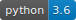

  
  
  
  <!---
  
-->
  

<h1 align="center" style="font-family:simplifica">SANDY</h1>

<h5 align="center">Sampling tool for nuclear data</h5>

 
 

SANDY is a python package that can read, write and perform a set of operations on nuclear data files in
[ENDF-6 format](https://www.oecd-nea.org/dbdata/data/manual-endf/endf102.pdf).

### Stochastic sampling of nuclear data 
The primary objective of the code, as it was originally conceived, is to produce *perturbed files* containing sampled parameters 
that represent the information stored in the evaluated nuclear data covariances.
Such files can be ultimately used to propagate uncertainties through any given compatible system using a brute force technique.

Currently, SANDY can draw samples for:
 - cross sections;
 - angular distrbutions of outgoing particles;
 - energy distrbutions of outgoing particles;
 - fission neutron multiplicities;
 - fission yields.

### API for ENDF-6 files
The recent development on SANDY extended the original goal and focused on providing a simple interface for nuclear data files in ENDF-6 format.
Nuclear data such as cross sections, fission yields, radioactive decay constants and so on can be imported into tabulated dataframes (making extensive use of `pandas`) for further post-processing, analysis, plotting, ...

Examples are available [here](https://luca-fiorito-11.github.io/sandy_notebooks/).
 
 ***

## :wrench: Installation

SANDY can be installed both on Linux (recommended) or Windows (using Anaconda).
The installation instructions are available [here](https://github.com/luca-fiorito-11/sandy/blob/develop/INSTALL.md).

 

## :notebook_with_decorative_cover: Documentation

The official SANDY documentation can be found [here](https://luca-fiorito-11.github.io/sandy-docs/index.html).

 

## :video_game: Jupyter notebooks

[Here](https://luca-fiorito-11.github.io/sandy_notebooks/) you can find some cool [Jupyter notebooks](https://jupyter.org/) that kind of give an idea of what one can do with SANDY. 

 

## :telephone_receiver: Contacts

* [**Luca Fiorito**](https://github.com/luca-fiorito-11) - lucafiorito.11@gmail.com

 

## :bookmark: Acknowledgments

SANDY was conceived and developed as a part of the PhD thesis on *Nuclear data uncertainty propagation and uncertainty quantification in nuclear codes* in the framework of a collaboration between [SCK CEN](https://www.sckcen.be) and [ULB](http://www.ulb.ac.be).

 

## :clipboard: Reference

Among the publications about SANDY, please use the following as a reference for citation.

L. Fiorito, G. Žerovnik, A. Stankovskiy, G. Van den Eynde, P.E. Labeau, [*Nuclear data uncertainty propagation to integral responses using SANDY*](http://www.sciencedirect.com/science/article/pii/S0306454916305278), Annals of Nuclear Energy, Volume 101, 2017, Pages 359-366, ISSN 0306-4549.

 

## :earth_africa: Publications

Below is a (incomplete) list of scientific studies about SANDY.

> If some info are not correct or missing, please let us know!

Neudecker, D., Cabellos, O., Clark, A.R., Haeck, W., Capote, R., Trkov, A., White, M.C., Rising, M.E.
Which nuclear data can be validated with LLNL pulsed-sphere experiments?
(2021) Annals of Nuclear Energy, 159, art. no. 108345, . 
https://www.scopus.com/inward/record.uri?eid=2-s2.0-85105590545&doi=10.1016%2fj.anucene.2021.108345&partnerID=40&md5=61a9a6561a26957cb9d0508d87834959

DOI: 10.1016/j.anucene.2021.108345

Kos, B., Grove, R.E., Kodeli, I.A.
From CAD to nuclear data S/U for shielding applications
(2020) Transactions of the American Nuclear Society, 122, pp. 625-628. 
https://www.scopus.com/inward/record.uri?eid=2-s2.0-85092203776&doi=10.13182%2fT122-32416&partnerID=40&md5=2add99e4007bb1aa2c52e84b0d75f4bc

DOI: 10.13182/T122-32416

Sui, Z., Cao, L., Wan, C., Zou, X.
Covariance-oriented sample transformation: A new sampling method for reactor-physics uncertainty analysis
(2019) Annals of Nuclear Energy, 134, pp. 452-463. 
https://www.scopus.com/inward/record.uri?eid=2-s2.0-85072272843&doi=10.1016%2fj.anucene.2019.07.001&partnerID=40&md5=e08c5089695828c7879c534c81a43f67

DOI: 10.1016/j.anucene.2019.07.001

Romojaro, P., Álvarez-Velarde, F., García-Herranz, N.
Sensitivity methods for effective delayed neutron fraction and neutron generation time with summon
(2019) Annals of Nuclear Energy, 126, pp. 410-418. 
https://www.scopus.com/inward/record.uri?eid=2-s2.0-85057459216&doi=10.1016%2fj.anucene.2018.11.042&partnerID=40&md5=c9dfe228d3bb7ca3fd7b91a641c4a12d

DOI: 10.1016/j.anucene.2018.11.042

Goričanec, T., Kos, B., Žerovnik, G., Marshall, M.A., Kodeli, I.A., Lengar, I., Štancar, Ž., Bess, J.D., Heinrichs, D.P., Kim, S.S., Zerkle, M.L., Snoj, L.
Evaluation of the criticality and reaction rate benchmark experiments utilizing UO2F2 aqueous solution of intermediate enrichment in spherical geometry at ORNL
(2019) Progress in Nuclear Energy, 111, pp. 97-108. 
https://www.scopus.com/inward/record.uri?eid=2-s2.0-85056226450&doi=10.1016%2fj.pnucene.2018.10.024&partnerID=40&md5=62d173a2f53ccadf0c510c1ba2093467

DOI: 10.1016/j.pnucene.2018.10.024

Abrate, N., Aufiero, M., Dulla, S., Fiorito, L.
Nuclear data uncertainty quantification in molten salt reactors with XGPT
(2019) International Conference on Mathematics and Computational Methods Applied to Nuclear Science and Engineering, M and C 2019, pp. 2348-2357. 
https://www.scopus.com/inward/record.uri?eid=2-s2.0-85075336363&partnerID=40&md5=23053c54dbd27849a555f0a6d427f748

Stankovskiy, A., Iwamoto, H., Çelik, Y., Van den Eynde, G.
High-energy nuclear data uncertainties propagated to MYRRHA safety parameters
(2018) Annals of Nuclear Energy, 120, pp. 207-218. 
https://www.scopus.com/inward/record.uri?eid=2-s2.0-85048381075&doi=10.1016%2fj.anucene.2018.05.041&partnerID=40&md5=4806dda020edda14693ca71d63b20454

DOI: 10.1016/j.anucene.2018.05.041

Trottier, A., Adams, F.P., Levinsky, A., Roubtsov, D.
Nuclear data sensitivity for reactor physics parameters in a lead-cooled reactor
(2018) Annals of Nuclear Energy, 120, pp. 333-347. 
https://www.scopus.com/inward/record.uri?eid=2-s2.0-85048130954&doi=10.1016%2fj.anucene.2018.05.047&partnerID=40&md5=592a1fded9a1bac786dcda721355503e

DOI: 10.1016/j.anucene.2018.05.047

Iwamoto, H., Stankovskiy, A., Fiorito, L., Eynde, G.V.D.
Monte Carlo uncertainty quantification of the effective delayed neutron fraction
(2018) Journal of Nuclear Science and Technology, 55 (5), pp. 539-547. 
https://www.scopus.com/inward/record.uri?eid=2-s2.0-85040986058&doi=10.1080%2f00223131.2017.1416691&partnerID=40&md5=6e723fa992bb23a5bdfb1f558f7ee90d

DOI: 10.1080/00223131.2017.1416691

Castro, E., Sánchez-Cervera, S., García-Herranz, N., Cuervo, D.
Impact of the homogenization level, nodal or pin-by-pin, on the uncertainty quantification with core simulators
(2018) Progress in Nuclear Energy, 104, pp. 218-228. 
https://www.scopus.com/inward/record.uri?eid=2-s2.0-85031316608&doi=10.1016%2fj.pnucene.2017.10.001&partnerID=40&md5=934c255c172e881d9fbb4f8b022ea7e8

DOI: 10.1016/j.pnucene.2017.10.001

Kos, B., Kodeli, I., Fiorito, L., Zerovnik, G.
Nuclear data uncertainty analysis of the tiara iron benchmark using the random sampling code sandy accelerated by the advantg hybrid transport code
(2018) International Conference on Physics of Reactors, PHYSOR 2018: Reactor Physics Paving the Way Towards More Efficient Systems, Part F168384-5, pp. 3066-3077. 
https://www.scopus.com/inward/record.uri?eid=2-s2.0-85106058892&partnerID=40&md5=55fef5d061a1e751ce8b6fc7cf139f0d

Hursin, M., Siefman, D., Perret, G., Rochman, D., Vasiliev, A., Ferroukhi, H.
Determination of Sobol sensitivity indices for correlated inputs with SHARK-X
(2018) International Conference on Physics of Reactors, PHYSOR 2018: Reactor Physics Paving the Way Towards More Efficient Systems, Part F168384-5, pp. 3078-3089. 
https://www.scopus.com/inward/record.uri?eid=2-s2.0-85079141095&partnerID=40&md5=de08bf715e1976c43d715fd274a99cf6

Ambrožič, K., Žerovnik, G., Snoj, L.
Computational analysis of the dose rates at JSI TRIGA reactor irradiation facilities
(2017) Applied Radiation and Isotopes, 130, pp. 140-152. 
https://www.scopus.com/inward/record.uri?eid=2-s2.0-85030097997&doi=10.1016%2fj.apradiso.2017.09.022&partnerID=40&md5=ce936e4571d9385642c07c4104275eb1

DOI: 10.1016/j.apradiso.2017.09.022

Griseri, M., Fiorito, L., Stankovskiy, A., Van den Eynde, G.
Nuclear data uncertainty propagation on a sodium fast reactor
(2017) Nuclear Engineering and Design, 324, pp. 122-130. 
https://www.scopus.com/inward/record.uri?eid=2-s2.0-85028988145&doi=10.1016%2fj.nucengdes.2017.08.018&partnerID=40&md5=244f028df2b88f35f8b1460a0da49a5d

DOI: 10.1016/j.nucengdes.2017.08.018

Stankovskiy, A., Çelik, Y., Eynde, G.V.D.
Impact of intermediate and high energy nuclear data on the neutronic safety parameters of MYRRHA accelerator driven system
(2017) EPJ Web of Conferences, 146, art. no. 09001, . 
https://www.scopus.com/inward/record.uri?eid=2-s2.0-85030483656&doi=10.1051%2fepjconf%2f201714609001&partnerID=40&md5=16458780820528ea5606fb87501cd54f

DOI: 10.1051/epjconf/201714609001

